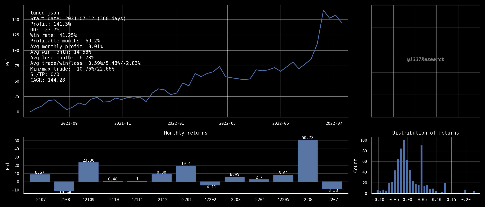

# Tuned plot

This script will plot your downloaded Tuned backtest data to a chart with stats, equity curve, monthly returns and
returns distribution.

Specify the filename with `--file foo.json` and resample the chart using `--resample W`

The other params can be used to plot vertical lines on the chart to distinguish different testing periods.

## Installation

    pip3 install -r requirements.txt

## Usage

    usage: tuned-plot.py [-h] [--datadir DATADIR] [--plotdir PLOTDIR] [--file FILE] [--oos OOS] [--forward FORWARD] [--live LIVE]
                     [--resample {D,W,M}]
    
    optional arguments:
      -h, --help          show this help message and exit
      --datadir DATADIR   Dir name where data is located e.g. data
      --plotdir PLOTDIR   Dir name where plots are output to e.g. plots
      --file FILE         Filename of Tuned json data, default tuned.json in data/
      --oos OOS           Plot grey line for out of sample period start date e.g. 20220101
      --forward FORWARD   Plot blue line for forward test period start date e.g. 20220201
      --live LIVE         Plot green line for live period start date e.g. 20220301
      --resample {D,W,M}  Resample equity curve using pandas period W, M etc

## Examples

Default usage will plot the data file data/tuned.json to a jpg at plots/tuned.json.jpg

    python3 tuned-plot.py

Add resample param to smooth the equity curve

    python3 tuned-plot.py --resample W

Specify the filename

    python3 tuned-plot.py --resample W --file foobar.json

## About

Visit https://app.tuned.com/t/1337Research/ for profitable systematic trading strategies.

## License

Free to use but you must keep the text @1337Research  